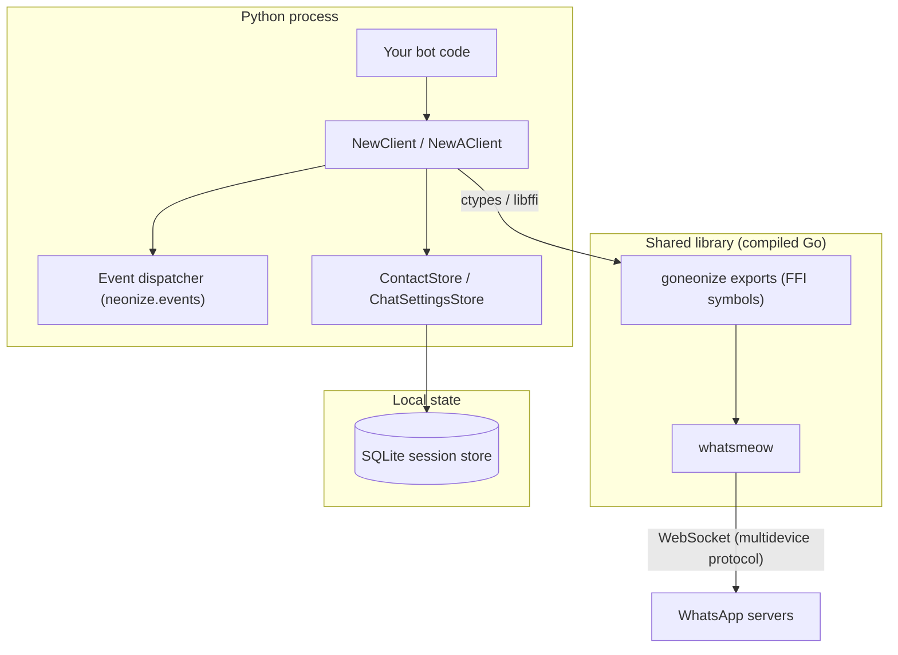

# Architecture

Neonize is a layered system. Understanding the layers explains both its
performance characteristics and its failure modes.



## Layer by Layer

### 1. Public clients

`neonize.client.NewClient` (synchronous) and `neonize.aioze.client.NewAClient`
(asyncio) expose the same ~100 methods. The async client wraps every blocking
call with `asyncio.to_thread`-style execution, so bot code never blocks the
event loop.

### 2. Binder (`neonize._binder`)

Loads the shared library with `ctypes.CDLL`, declares each exported symbol's
signature, and verifies that the library version matches the Python package
version. A mismatch raises immediately instead of failing later at call time.

### 3. Go core (`goneonize`)

A thin Go wrapper around [whatsmeow](https://github.com/tulir/whatsmeow)
exporting C ABI functions such as `SendMessage`, `RejectCall`, or
`GetVersion`. It owns the WebSocket connection, encryption, retry logic and
protocol details.

### 4. Stores

Two SQLite-backed stores live on the Python side:

| Store | Purpose |
| --- | --- |
| `ContactStore` (`client.contact`) | Persisted contacts and their metadata |
| `ChatSettingsStore` (`client.chat_settings`) | Per-chat mute, pin, and archive state |

The session keys and identity of the linked device itself are managed inside
the Go core's own SQLite store.

## Threading Model

The synchronous client runs the WhatsApp event loop on a background thread.
Events are dispatched to your registered handlers from there — handlers run
sequentially, so a slow handler delays subsequent events.

```text
Go thread:  WebSocket -> goneonize -> ctypes callback -> Event dispatcher -> your handlers
```

The async client dispatches into asyncio coroutines instead; see
[Best Practices](../async/best-practices.md) for the implications.

## Version Coupling

The Go core version is pinned to the Python package version (for example,
both `0.4.3`). This guarantees FFI signatures always match. When building
from source yourself, keep them in sync — see
[Building from Source](../development/building.md).
