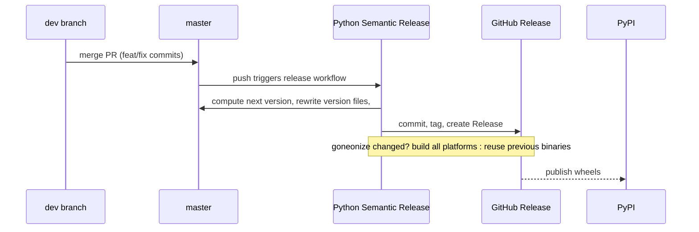

# Release Process

Releases are fully automated from `master`.

## Flow

## Version Rules

| Last commit(s) since previous tag | Bump | Example |
| --- | --- | --- |
| `fix:` / `perf:` only | patch | 0.4.3 -> 0.4.4 |
| any `feat:` | minor | 0.4.3 -> 0.5.0 |
| `feat!:` or breaking change footer | major | 0.5.0 -> 1.0.0 |
| only chore/docs/ci/style/test | none | no release |

Version 0.x stays in 0.x (no automatic jump to 1.0.0).

## What the Pipeline Does

1. **release-version** — computes the version, rewrites
   `neonize/__init__.py`, `neonize/download.py`, `goneonize/version.go`,
   updates `CHANGELOG.md`, tags and creates the GitHub Release.
2. **changes** — diffs `goneonize/**` against the previous release.
3. **build** — compiles shared libraries for Android, Windows (zig cc),
   Linux and macOS; if `goneonize/` did not change it downloads the
   previous binaries instead of rebuilding (saves minutes per platform).
4. **publish** — uploads every wheel to the GitHub Release and publishes
   once to PyPI.

## Documentation Deployment

Docs deploy separately via `.github/workflows/docs.yml`:

| Trigger | Result |
| --- | --- |
| push to `master` / `dev` | docs published as version `dev` |
| push of a release tag | docs published under that minor version and aliased `latest` |
| manual dispatch with version input | docs published under the given version |

The version selector at the top of the site switches between them.

## Manual Trigger

The release workflow also accepts `workflow_dispatch` for re-running a
failed pipeline without new commits.
